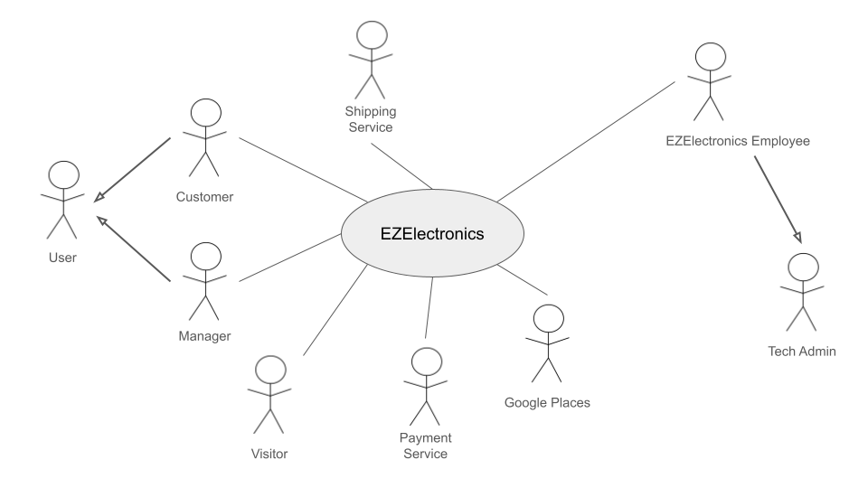
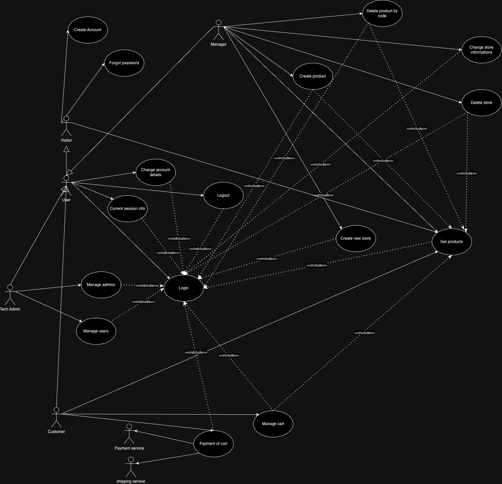

# Requirements Document - future EZElectronics

Date:

Version: V1—description of EZElectronics in FUTURE form (as proposed by the team)

| Version number |                                     Change                                      |
|:--------------:|:-------------------------------------------------------------------------------:|
|      1.0       | Add Stakeholder, Stories and Personas, Functional and Non Function requirements |
|      1.1       |                         Add context diagram and images                          |
|      1.2       |                           Add use cases and glossary                            |
|      1.3       |                                Add GUI Prototype                                |
|      1.4       |                           Finish Requirement document                           |

# Contents

- [Requirements Document - future EZElectronics](#requirements-document---future-ezelectronics)
- [Contents](#contents)
- [Informal description](#informal-description)
- [Stakeholders](#stakeholders)
- [Context Diagram and interfaces](#context-diagram-and-interfaces)
    - [Context Diagram](#context-diagram)
    - [Interfaces](#interfaces)
- [Stories and personas](#stories-and-personas)
- [Functional and non functional requirements](#functional-and-non-functional-requirements)
    - [Functional Requirements](#functional-requirements)
    - 
    - [Non Functional Requirements](#non-functional-requirements)
- [Use case diagram and use cases](#use-case-diagram-and-use-cases)
    - [Use case diagram](#use-case-diagram)
        - [Use case 1, UC1](#use-case-1-uc1)
            - [Scenario 1.1](#scenario-11)
            - [Scenario 1.2](#scenario-12)
            - [Scenario 1.x](#scenario-1x)
        - [Use case 2, UC2](#use-case-2-uc2)
        - [Use case x, UCx](#use-case-x-ucx)
- [Glossary](#glossary)
- [System Design](#system-design)
- [Deployment Diagram](#deployment-diagram)

# Informal description

EZElectronics (read EaSy Electronics) is a software application designed to help managers of electronics stores to
manage their products and offer them to customers through a dedicated website. Managers can assess the available
products, record new ones, and confirm purchases. Customers can see available products, add them to a cart and see the
history of their past purchases.

# Stakeholders

|             Stakeholder name             |                                          Description                                          |
|:----------------------------------------:|:---------------------------------------------------------------------------------------------:|
|                   User                   |       People using the website than can be either using as customers or store managers        |
|                 Visitor                  | People who are not logged in and are visiting the website to see the products and the prices  |
|                 Customer                 |     People using the website to buy electronics products from electronics store managers      |
|                 Manager                  | People who are electronics store managers and showcase their products online and manage sales |
|         EZElectronics Employees          |                      (TechAdmin, Investors, Legal team, Marketing Team)                       |
| Regulatory agencies/ Compliance agencies |       Partner agencies that EZElectronics consults in order to comply with regulations        |
|   Product suppliers and manufacturers    |   Manufacturers of electronics products from whom the store managers obtain their products    |
|               Competitors                |                  Similar companies that have a software with the same scope                   |
|             Payment Service              | People who have invested in the company and are interested in the company's financial status  |
|             Shipping Service             |            People who are responsible for delivering the products to the customers            |

# Context Diagram and interfaces

## Context Diagram

## Interfaces

|           Actor            | Logical Interface |                                                           Physical Interface                                                            |
|:--------------------------:|:-----------------:|:---------------------------------------------------------------------------------------------------------------------------------------:|
|          Customer          |  PC, Smartphone   |                                                                   GUI                                                                   |
|          Manager           |  PC, Smartphone   |                                                                   GUI                                                                   |
| Tech Admin, Business Admin |  PC, Smartphone   |                                                                   GUI                                                                   |
|      Payment Service       |     Internet      | https://developer.paypal.com/api/rest/ , https://developer.visa.com/pages/working-with-visa-apis, https://developer.mastercard.com/apis |
|      Shipping Service      |     Internet      |                                                 https://www.ufficiopostale.com/api.php                                                  |

# Stories and personas

Persona 1:

- Marco, 35 Male, with some computer science and tech background, store manager for over a decade

Story:

- Marco stumbled upon EZElectronics while searching for inventory management solutions. The user-friendly interface and
  features like automatic website updates and purchase confirmation caught Marco’s attention. With EZElectronics, Marco
  can now efficiently manage inventory, update the store's website, and provide a seamless shopping experience for
  customers.

Persona 2:

- Anna, a 28 Female, newly opened her own electronics shop, has very little time on her hands.

Story:

- Anna heard about EZElectronics from a fellow business owner and decided to give it a try. The simplicity of the
  application allowed Anna to quickly get up and running. Now, Anna can easily add new products, track inventory, and
  manage customer orders without spending hours on paperwork. EZElectronics has become an invaluable tool in helping
  Anna grow her business.

Persona 3:

- Emilia, 25 Female, a Frequent Online Shopper, is a tech enthusiast who loves to stay updated with the latest gadgets.
  With a busy schedule, Emilia prefers shopping online for convenience.

Story:

- Emilia discovered EZElectronics while browsing for new gadgets online. The user-friendly website interface and wide
  range of products caught Emilia’s attention. Now, Emilia can easily browse through available products, add them to her
  cart, and track her purchase history. With EZElectronics, Emilia enjoys a hassle-free shopping experience and can
  quickly get her hands on the latest tech gadgets.

Persona 4:

- Donald, 40 Male, Retail Operations Manager, oversees multiple electronics stores for a retail chain. With stores
  located across different regions, keeping track of inventory and managing purchases manually has become a daunting
  task.

Story:

- Donald was tasked with finding a centralized solution to streamline inventory management and online sales for the
  retail chain. After researching various options, Donald chose EZElectronics for its comprehensive features and
  scalability. With EZElectronics, Donald can now efficiently manage inventory across multiple stores, track sales
  performance, and ensure a seamless shopping experience for customers.

Persona 5:

- Lisa, 32, a Female, Stay-at-home Parent Turned Entrepreneur, has recently become a stay-at-home parent after having
  her second child. Wanting to contribute to the household income while taking care of her children, Lisa decided to
  start an online electronics store.

Story:

- Lisa faced many challenges in setting up her online store, from managing inventory to attracting customers. However,
  EZElectronics came to the rescue with its user-friendly platform and helpful features. Now, Lisa can easily manage her
  store, add new products, and fulfill orders, all while taking care of her children. EZElectronics has empowered Lisa
  to pursue her entrepreneurial dreams while balancing her family responsibilities.

# Table of access rights

|      Role      | FR1 | FR2.1 | FR2.2 | FR2.3 | FR2.4 | FR2.5 | FR2.6 | FR3 | FR4 | FR5 |
|:--------------:|:---:|:-----:|:-----:|:-----:|:-----:|:-----:|:-----:|:---:|:---:|:---:|
|    Manager     |  Y  |   N   |   N   |   N   |   Y   |   Y   |   N   |  Y  |  Y  |  N  |
|    Customer    |  Y  |   Y   |   Y   |   Y   |   Y   |   Y   |   Y   |  Y  |  N  |  N  |
|   Tech Admin   |  Y  |   Y   |   Y   |   Y   |   Y   |   Y   |   Y   |  Y  |  Y  |  Y  |
| Business Admin |  Y  |   Y   |   Y   |   Y   |   Y   |   Y   |   Y   |  Y  |  Y  |  Y  |

# Functional and non functional requirements

## Functional Requirements
|   ID    |                  Description                   |
|:-------:|:----------------------------------------------:|
|   FR1   |                 Create account                 |
|  FR1.1  |             Create manager account             |
|  FR1.2  |            Create customer account             |
|  FR1.3  |        Validate account creation fields        |
|   FR2   |                Manage products                 |
|  FR2.1  |                 Create product                 |
|  FR2.2  |               Register arrivals                |
|  FR2.3  |              Approve Transaction               |
|  FR2.4  |              Find product by code              |
|  FR2.5  |               List all products                |
| FR2.5.1 |       filter products based on category        |
| FR2.5.1 |         filter products based on model         |
| FR2.5.1 |      filter products based on sold status      |
|  FR2.6  |        Delete specific product by code         |
|  FR2.7  |           Get store by product code            |
|  FR2.8  |                  Change store                  |
|   FR3   |        Authorization and authentication        |
|  FR3.1  |                     login                      |
|  FR3.2  |                     logout                     |
|  FR3.3  |            Get current Session Info            |
|   FR4   |                Cart Management                 |
|  FR4.1  | Access and view current cart of logged in user |
|  FR4.2  |    Add product to cart by productId (code)     |
|  FR4.3  |            Delete product from cart            |
|  FR4.4  |                Pay for the cart                |
|  FR4.5  |          List and access cart history          |
|  FR4.6  |                Delete the cart                 |
|  FR4.7  |                  Request cart                  |
|   FR5   |             Manage Account Manager             |
|  FR5.1  |             Create account Manager             |
|   FR6   |          Refund and manager Payments           |
|  FR6.1  |         Allow user to request a refund         |
|  FR6.2  |                Authorize refund                |
|  FR6.3  |              Payment of customer               |
|   FR7   |                 Manage stores                  |
|  FR7.1  |               Create a new Store               |
|  FR7.2  |          Change Store’s information's          |
|  FR7.3  |                  Delete store                  |
|   FR8   |         Manage Account’s information's         |
|  FR8.1  |             Change Account details             |
|  FR8.2  |                Forgot Password                 |
|   FR9   |                 Manage payment                 | 
|  FR9.1  |               Add payment method               |
|  FR9.2  |                  Make payment                  | 
|  FR10   |                Manage shipping                 |
| FR10.1  |            calculate shipping cost             |
| FR10.2  |           add shipping cost to cart            |

## Non Functional Requirements

|  ID  | Type (efficiency, reliability, ..) |                                                                                                          Description                                                                                                          |     Refers to     |
|:----:|:----------------------------------:|:-----------------------------------------------------------------------------------------------------------------------------------------------------------------------------------------------------------------------------:|:-----------------:|
| NFR1 |             Usability              |                                The user interface should be friendly enough so that the customers become able to navigate around the website and use all the functionalities under 15 minutes                                 | FR1,FR2, FR3, FR4 |
| NFR2 |             Efficiency             |                                                                    The page should respond and be navigable in 0.5 second regardless of network latencies.                                                                    | FR1,FR2, FR3, FR4 |
| NFR3 |             Efficiency             |                                                                                            Ram occupation should be under 300 MB.                                                                                             | FR1,FR2, FR3, FR4 |
| NFR4 |            Reliability             |                                                          Number of defects and failures during transactions should be less than 1% of the total amount of tentative.                                                          |   FR4.4, FR9.9    |
| NFR5 |            Portability             | Should be available as a web app (and have proper browser support and possibility to be viewed on old machines) Universal/legacy browser compatibility: Chrome 123.0.0, Firefox 125.0.1,  Safari 17.4.1, Internet explorer 11 | FR1,FR2, FR3, FR4 |
| NFR6 |              Security              |                         payments should be made through secure payment gateways, all the data should be encrypted, and the website should be protected against SQL injection, XSS, and CSRF attacks.                          |        FR9        |
# Use case diagram and use cases

## Use case diagram

## Use cases

### Create Account user, UC1 - FR1

| Actors Involved  |                             User                              |
|:----------------:|:-------------------------------------------------------------:|
|   Precondition   |                  User does not have account                   |
|  Post condition  |                               -                               |
| Nominal Scenario |                         Scenario 1.1                          |
|     Variants     |                 Scenario 1.2(create manager)                  |
|    Exceptions    | Scenario 1.3 (username exists), Scenario 1.4 (invalid inputs) |

##### Scenario 1.1 (create customer account) - FR1.2

|  Scenario 1.1  |                                                                       |
|:--------------:|:---------------------------------------------------------------------:|
|  Precondition  |                      User does not have account                       |
| Post condition |                       User has customer account                       |
|     Step#      |                              Description                              |
|       1        |                      user selects role customer                       |
|       2        |      user inputs and enter username, name, email, surname and password       |
|       3        |          database searched for username, duplicate not found          |
|       4        | FR1.3: input fields are validated, they are conforming to constraints |
|       5        |          database searched for email, duplicate not found         |
|       6       |          System sends a verification code to the specified email and ask it to user        |
|       7       |          user sends the code, right code       |
|       8        |          FR1.1: A customer account gets created for the user          |

##### Scenario 1.2 (create manager account) - FR1.1

|  Scenario 1.2  |                                                                       |
|:--------------:|:---------------------------------------------------------------------:|
|  Precondition  |                      User does not have account                       |
| Post condition |                       User has manager account                        |
|     Step#      |                                                            Description                              |
|       1        |                      user selects role Manager                       |
|       2        |      user inputs and enter username, name, email, surname and password       |
|       3        |          database searched for username, duplicate not found          |
|       4        | FR1.3: input fields are validated, they are conforming to constraints |
|       5        |          database searched for email, duplicate not found         |
|       6       |          System sends a verification code to the specified email and ask it to user        |
|       7       |          user sends the code, right code       |
|       8        |          FR1.2: A Manager account gets created for the user          |

##### Scenario 1.3 (username exists)

|  Scenario 1.3  |                                                            |
|:--------------:|:----------------------------------------------------------:|
|  Precondition  |                 User does not have account                 |
| Post condition |                 User does not have account                 |
|     Step#      |                        Description                         |
|       1        |                 user selects role Manager                  |
|       2        | user inputs and enter username, name, email, surname and password |
|       3        |      database searched for username, duplicate found       |
|       4        |     show error saying that the username already exists     |
|       5        |           user remains in account creation page            |

##### Scenario 1.4 (invalid inputs)

|  Scenario 1.4  |                                                                          |
|:--------------:|:------------------------------------------------------------------------:|
|  Precondition  |                        User does not have account                        |
| Post condition |                        User does not have account                        |
|     Step#      |                               Description                                |
|       1        |                        user selects role Manager                         |
|       2        |        user inputs and enter username, name, email, surname and password        |
|       3        |           database searched for username, duplicate not found            |
|       4        | FR1.3:input fields are validated, they not are conforming to constraints |
|       5        |      show error saying that the are problems with the input fields       |
|       6        |                  user remains in account creation page                   |

##### Scenario 1.5 (email already exists) 

|  Scenario 1.5  |                                                                       |
|:--------------:|:---------------------------------------------------------------------:|
|  Precondition  |                      User does not have account                       |
| Post condition |                       User does not have account                       |
|     Step#      |                              Description                              |
|       1        |                      user selects role customer                       |
|       2        |      user inputs and enter username, name, email, surname and password       |
|       3        |          database searched for username, duplicate not found          |
|       4        | FR1.3: input fields are validated, they are conforming to constraints |
|       5        |          database searched for email, duplicate found         |
|       6        |      show error saying that the are problems with the input fields       |
|       7       |                  user remains in account creation page 

##### Scenario 1.6 (wrong verification code) 

|  Scenario 1.6  |                                                                       |
|:--------------:|:---------------------------------------------------------------------:|
|  Precondition  |                      User does not have account                       |
| Post condition |                       User does not have account                       |
|     Step#      |                              Description                              |
|       1        |                      user selects role customer                       |
|       2        |      user inputs and enter username, name, email, surname and password       |
|       3        |          database searched for username, duplicate not found          |
|       4        | FR1.3: input fields are validated, they are conforming to constraints |
|       5        |          database searched for email, duplicate not found         |
|       6       |          System sends a verification code to the specified email and ask it to user        |
|       7       |          user sends the code, right code       |
|       8        |      show error saying that the are problems with the input fields       |
|       9       |                  user remains in account creation page 

### Login, UC2 - FR3.1

| Actors Involved  |                       User                       |
|:----------------:|:------------------------------------------------:|
|   Precondition   |                user not logged in                |
|  Post condition  |                        -                         |
| Nominal Scenario |                   Scenario 2.1                   |
|     Variants     |                        -                         |
|    Exceptions    | Scenario 2.2 (username and password don't match) |

##### Scenario 2.1

|  Scenario 2.1  |                                                                  |
|:--------------:|:----------------------------------------------------------------:|
|  Precondition  |                        user not logged in                        |
| Post condition |                          user logged in                          |
|     Step#      |                           Description                            |
|       1        |                user inputs username and password                 |
|       2        | database searched for username, check password, password matched |
|       3        |                    FR3.1: user gets logged in                    |

##### Scenario 2.2 (username and password don't match)

|  Scenario 2.2  |                                                                        |
|:--------------:|:----------------------------------------------------------------------:|
|  Precondition  |                           user not logged in                           |
| Post condition |                           user not logged in                           |
|     Step#      |                              Description                               |
|       1        |                   user inputs username and password                    |
|       2        | database searched for username, check password, password doesn't match |
|       3        |                      user does not get logged in                       |

### Logout, UC3 - FR3.2

| Actors Involved  |        User        |
|:----------------:|:------------------:|
|   Precondition   |   user logged in   |
|  Post condition  | user not logged in |
| Nominal Scenario |    Scenario 3.1    |
|     Variants     |         -          |
|    Exceptions    |         -          |

##### Scenario 3.1 - FR3.2

|  Scenario 3.1  |                            |
|:--------------:|:--------------------------:|
|  Precondition  |       user logged in       |
| Post condition |     user not logged in     |
|     Step#      |        Description         |
|       1        | user asks to be logged out |
|       2        | FR3.2:user gets logged out |

### Current session info, UC4 - FR3.3

| Actors Involved  |                    User                    |
|:----------------:|:------------------------------------------:|
|   Precondition   |               user logged in               |
|  Post condition  | user receives information on their session |
| Nominal Scenario |                Scenario 4.1                |
|     Variants     |                     -                      |
|    Exceptions    |                     -                      |

##### Scenario 4.1 - FR3.3

|  Scenario 4.1  |                                               |
|:--------------:|:---------------------------------------------:|
|  Precondition  |                user logged in                 |
| Post condition |  user receives information on their session   |
|     Step#      |                  Description                  |
|       1        |     user asks to get current session info     |
|       2        | FR3.3:user receives their profile information |

### Forgot password, UC1
| Actors Involved  |                     Customer, Manager                      |
|------------------|:----------------------------------------------------------:| 
| Precondition     |            User has an account on EZelectronics            |
| Post condition   |                             -                              |
| Nominal Scenario |                        Scenario 1.1                        |
| Variants         |                        Scenario 1.2                        |
| Exceptions       | Scenario 1.3(incorrect code), Scenario 1.4(user not found) |

##### Scenario 1.1

| Scenario 1.1   |                                                                       |
|----------------|:---------------------------------------------------------------------:| 
| Precondition   |               Customer has an account on EZelectronics                |
| Post condition |                       Customer changed password                       |
| Step#          |                              Description                              |
| 1              |                       Customer provide username                       |  
| 2              |               Search for username, find an existing one               | 
| 3              |                  Send verification email to Customer                  |  
| 4              |                       Request verification code                       |
| 5              |                  Customer input a verification code                   |
| 6              |                         Check correctness, ok                         |
| 7              |                         Request new Password                          |
| 8              |             Validate the password, successful validation              |
| 9              | Show a message to Customer saying that the password has been modified |

##### Scenario 1.2

| Scenario 1.2   |                                                                      |
|----------------|:--------------------------------------------------------------------:| 
| Precondition   |               Manager has an account on EZelectronics                |
| Post condition |                       Manager changed password                       |
| Step#          |                             Description                              |
| 1              |                       Manager provide username                       |  
| 2              |              Search for username, find an existing one               | 
| 3              |                  Send verification email to Manager                  |  
| 4              |                      Request verification code                       |
| 5              |                  Manager input a verification code                   |
| 6              |                        Check correctness, ok                         |
| 7              |                         Request new Password                         |
| 8              |         FR1.3: Validate the password, successful validation          |
| 9              | Show a message to Manager saying that the password has been modified |

##### Scenario 1.3

| Scenario 1.3   |                                           |
|----------------|:-----------------------------------------:| 
| Precondition   |   User has an account on EZelectronics    |
| Post condition |        User didn't change password        |
| Step#          |                Description                |
| 1              |           User provide username           |  
| 2              | Search for username, find an existing one | 
| 3              |      Send verification email to User      |  
| 4              |         Request verification code         |
| 5              |      User input a verification code       |
| 6              |      Check correctness, not correct       |
| 7              |                Show error                 |

##### Scenario 1.4

| Scenario 1.4   |                                      |
|----------------|:------------------------------------:| 
| Precondition   | User has an account on EZelectronics |
| Post condition |     User didn't change password      |
| Step#          |             Description              |
| 1              |        User provide username         |  
| 2              |    Search for username, not found    | 
| 3              |              Show error              |

### Change account details, UC2

| Actors Involved  |                                                             Customer, Manager                                                              |
|------------------|:------------------------------------------------------------------------------------------------------------------------------------------:| 
| Precondition     |                                                           User is authenticated                                                            |
| Post condition   |                                                                                                                                            |
| Nominal Scenario |                            Scenario 2.1, Scenario 2.1, Scenario 2.3, Scenario 2.4, Scenario 2.5,  Scenario 2.6                             |
| Variants         |                                                                Scenario 2.7                                                                |
| Exceptions       | Scenario 2.8(username already exixting), Scenario 2.9(Inexistent email), Scenario 2.10(mail already used), Scenario 2.11(invalid password) |

##### Scenario 2.1

| Scenario 2.1   |                                                                   |
|----------------|:-----------------------------------------------------------------:| 
| Precondition   |                       User is authenticated                       |
| Post condition |                       User changed username                       |
| Step#          |                            Description                            |
| 1              |                     User provide new username                     |  
| 2              |           Search for username, username Inexistent, ok            | 
| 3              | Show a message to User saying that the username has been modified |

##### Scenario 2.2

| Scenario 2.2   |                                                               |
|----------------|:-------------------------------------------------------------:| 
| Precondition   |                     User is authenticated                     |
| Post condition |                       User changed name                       |
| Step#          |                          Description                          |
| 1              |                     User provide new name                     |  
| 2              |                       name not null, ok                       | 
| 3              | Show a message to User saying that the name has been modified |

##### Scenario 2.3

| Scenario 2.3   |                                                                  |
|----------------|:----------------------------------------------------------------:| 
| Precondition   |                      User is authenticated                       |
| Post condition |                       User changed surname                       |
| Step#          |                           Description                            |
| 1              |                     User provide new surname                     |  
| 2              |                       surname not null, ok                       | 
| 3              | Show a message to User saying that the surname has been modified |

##### Scenario 2.4

| Scenario 2.4   |                                                                  |
|----------------|:----------------------------------------------------------------:| 
| Precondition   |                    Customer is authenticated                     |
| Post condition |                     Custemer changed address                     |
| Step#          |                           Description                            |
| 1              |                   Customer provide new address                   |  
| 2              |                      address exixsting, ok                       | 
| 3              | Show a message to User saying that the address has been modified |

##### Scenario 2.5

| Scenario 2.5   |                                                                 |
|----------------|:---------------------------------------------------------------:| 
| Precondition   |                      User is authenticated                      |
| Post condition |                       User changed e-mail                       |
| Step#          |                           Description                           |
| 1              |                    User provide new e-amail                     |  
| 2              |               search for email, not existing: ok                | 
| 3              |                 Send verification email to User                 |  
| 4              |                    Request verification code                    |
| 5              |                 User input a verification code                  |
| 6              |                   Check correctness, correct                    |
| 7              | Show a message to User saying that the e-mail has been modified |

##### Scenario 2.6

| Scenario 2.6   |                                                                   |
|----------------|:-----------------------------------------------------------------:| 
| Precondition   |                       User is authenticated                       |
| Post condition |                       User changed password                       |
| Step#          |                            Description                            |
| 1              |                     User provide new password                     |  
| 2              |          FR1.3: validate password with safety rules, ok           | 
| 3              | Show a message to User saying that the password has been modified |

##### Scenario 2.7

| Scenario 2.7   |                                                                  |
|----------------|:----------------------------------------------------------------:| 
| Precondition   |                     Manager is authenticated                     |
| Post condition |                       Manager changed name                       |
| Step#          |                           Description                            |
| 1              |                     Manager provide new name                     |  
| 2              |                        name not null, ok                         | 
| 3              | Show a message to Manager saying that the name has been modified |

##### Scenario 2.8

| Scenario 2.8   |                                              |
|----------------|:--------------------------------------------:| 
| Precondition   |            User is authenticated             |
| Post condition |            username not modified             |
| Step#          |                 Description                  |
| 1              |          User provide new username           |  
| 2              | Search for username, username already exists | 
| 3              |                  Show error                  |

##### Scenario 2.9

| Scenario 2.9   |                                    |
|----------------|:----------------------------------:| 
| Precondition   |       User is authenticated        |
| Post condition |        e-mail not modified         |
| Step#          |            Description             |
| 1              |      User provide new e-amail      |  
| 2              | search for email, not existing: ok | 
| 3              |  Send verification email to User   |  
| 4              |     Request verification code      |
| 5              |   User input a verification code   |
| 6              |   Check correctness, not correct   |
| 7              |            Show error.             |

##### Scenario 2.10

| Scenario 2.10  |                                    |
|----------------|:----------------------------------:| 
| Precondition   |       User is authenticated        |
| Post condition |        e-mail not modified         |
| Step#          |            Description             |
| Step#          |            Description             |
| 1              |      User provide new e-amail      |  
| 2              | search for email, already existing | 
| 3              |            Show error.             |

##### Scenario 2.11

| Scenario 2.11  |                                                                 |
|----------------|:---------------------------------------------------------------:| 
| Precondition   |                      User is authenticated                      |
| Post condition |                      password not modified                      |
| Step#          |                           Description                           |
| 1              |                    User provide new password                    |  
| 2              | FR1.3: validate password with safety rules, rules not satisfied | 
| 3              |                           Show error                            |

### Create new Store, UC3

| Actors Involved  |                     Manager                     |
|------------------|:-----------------------------------------------:| 
| Precondition     | User has an account and is logged in as Manager |
| Post condition   |                                                 |
| Nominal Scenario |                  Scenario 3.1                   |
| Variants         |                                                 |
| Exceptions       |        Scenario 3.2(inexistent address)         |

##### Scenario 3.1

| Scenario 3.1   |                                                                      |
|----------------|:--------------------------------------------------------------------:| 
| Precondition   |           User has an account and is logged in as Manager            |
| Post condition |                         New Store is created                         |
| Step#          |                             Description                              |
| 1              |                Manager inputs Store name and address                 |  
| 2              |               Search for address, find an existing one               | 
| 3              | Show a message to Manager saying that the new store has been Created |

##### Scenario 3.2

| Scenario 3.2   |                                                 |
|----------------|:-----------------------------------------------:| 
| Precondition   | User has an account and is logged in as Manager |
| Post condition |          The new store is not created           |
| Step#          |                   Description                   |
| 1              |      Manager inputs Store name and address      | 
| 2              |                Name not null, ok                | 
| 3              |   Search for address, address doesn't exists    | 
| 4              |                   Show error.                   |

### Change Store informations, UC4

| Actors Involved  |                     Manager                     |
|------------------|:-----------------------------------------------:| 
| Precondition     | User has an account and is logged in as Manager |
| Post condition   |                        -                        |
| Nominal Scenario |                  Scenario 4.1                   |
| Variants         |                  Scenario 4.2                   |
| Exceptions       |      Scenario 4.3(inexistent new address)       |

##### Scenario 4.1

| Scenario 4.1   |                                                                    |
|----------------|:------------------------------------------------------------------:| 
| Precondition   |          User has an account and is logged in as Manager           |
| Post condition |                      Store's name is modified                      |
| Step#          |                            Description                             |
| 1              |                Manager inputs the new store's name                 |  
| 2              |                         name not null, ok                          | 
| 3              | Show a message to Manager saying that the  store has been modified |

##### Scenario 4.2

| Scenario 4.2   |                                                                    |
|----------------|:------------------------------------------------------------------:| 
| Precondition   |          User has an account and is logged in as Manager           |
| Post condition |                    Store's address is modified                     |
| Step#          |                            Description                             |
| 1              |               Manager inputs the new store's address               |  
| 2              |              Search for address, find an existing one              | 
| 3              | Show a message to Manager saying that the  store has been modified |

##### Scenario 4.3

| Scenario 4.3   |                                                 |
|----------------|:-----------------------------------------------:| 
| Precondition   | User has an account and is logged in as Manager |
| Post condition |       The store's address is not modified       |
| Step#          |                   Description                   |
| 1              |       Manager inputs new store's address        |  
| 2              |   Search for address, address doesn't exists    | 
| 3              |                   Show error.                   |

### Delete Store, UC5

| Actors Involved  |                     Manager                     |
|------------------|:-----------------------------------------------:| 
| Precondition     | User has an account and is logged in as Manager |
| Post condition   |                        -                        |
| Nominal Scenario |                  Scenario 5.1                   |
| Variants         |                        -                        |
| Exceptions       |                        -                        |

##### Scenario 5.1

| Scenario 5.1   |                                                    |
|----------------|:--------------------------------------------------:| 
| Precondition   |  User has an account and is logged in as Manager   |
| Post condition |                  Store is deleted                  |
| Step#          |                    Description                     |
| 1              |         Manager request to delete a store          |  
| 2              | the system retrives all the products of that store | 
| 3              |    Each product of the store is deleted - F2.6     |

### Create Product , UC5

| Actors Involved  |                                                                          Manager                                                                          |
|:----------------:|:---------------------------------------------------------------------------------------------------------------------------------------------------------:|
|   Precondition   |                                                                 user logged in as manager                                                                 |
|  Post condition  |                                                                             -                                                                             |
| Nominal Scenario |                                                                       Scenario 5.1                                                                        |
|     Variants     |                                                                       Scenario 5.2                                                                        |
|    Exceptions    | Scenario 5.3(product's code alreasy exists), Scenario 5.4(inexistent store/manager does't possess store), Scenario 5.5 (Arrival date asfter current date) |

##### Scenario 5.1

|  Scenario 5.1  |                                                                                                    |
|:--------------:|:--------------------------------------------------------------------------------------------------:|
|  Precondition  |                                     user logged in as Manager                                      | 
| Post condition |                                          Product created                                           |
|     Step#      |                                            Description                                             |
|       1        | User inserts product info: code, sellingPrice, model, category, details, arrivalDate, store's code |
|       2        |                            system checks code, does not already exists                             |
|       3        |                       system checks arrival date, exists and is current date                       |
|       4        |             system checks code's store is associated to current manager and exist ,ok              |
|       5        |                                   system validates other fields                                    |
|       6        |                                 product added, return product code                                 |

##### Scenario 5.2

|  Scenario 5.2  |                                                                                        |
|:--------------:|:--------------------------------------------------------------------------------------:|
|  Precondition  |                               user logged in as Manager                                |
| Post condition |                                    Product created                                     |
|     Step#      |                                      Description                                       |
|       1        | User inserts product info: code, sellingPrice, model, category, details,  store's code |
|       2        |                      system checks code, does not already exists                       |
|       3        |                       system checks arrival date, does not exist                       |
|       4        |                        system sets arrival date to current date                        |
|       5        |       system checks code's store is associated to current manager and exist ,ok        |
|       6        |              system validates other fields, they comply with constraints               |
|       7        |                           product added, return product code                           |

##### Scenario 5.3

|  Scenario 5.3  |                                                                                                    |
|:--------------:|:--------------------------------------------------------------------------------------------------:|
|  Precondition  |                                     user logged in as Manager                                      | 
| Post condition |                                        Product not created                                         |
|     Step#      |                                            Description                                             |
|       1        | User inserts product info: code, sellingPrice, model, category, details, arrivalDate, store's code |
|       2        |                                 system checks code, already exists                                 |
|       3        |                                             Show error                                             |

##### Scenario 5.4

|  Scenario 5.4  |                                                                                                    |
|:--------------:|:--------------------------------------------------------------------------------------------------:|
|  Precondition  |                                     user logged in as Manager                                      | 
| Post condition |                                        Product not created                                         |
|     Step#      |                                            Description                                             |
|       1        | User inserts product info: code, sellingPrice, model, category, details, arrivalDate, store's code |
|       2        |                            system checks code, does not already exists                             |
|       3        |                       system checks arrival date, exists and is current date                       |
|       4        |           system checks code's store is associated to current manager and exist , not ok           |
|       5        |                                             show error                                             |

##### Scenario 5.5

|  Scenario 5.5  |                                                                                                    |
|:--------------:|:--------------------------------------------------------------------------------------------------:|
|  Precondition  |                                     user logged in as Manager                                      |
| Post condition |                                        Product not created                                         |
|     Step#      |                                            Description                                             |
|       1        | User inserts product info: code, sellingPrice, model, category, details, arrivalDate, store's code |
|       2        |                            system checks code, does not already exists                             |
|       3        |                         system checks arrival date, is after current date                          |
|       4        |                  system shows error describing that the arrivalDate is incorrect                   |

### Register arrivals , UC6

| Actors Involved  |                                                   Manager                                                   |
|:----------------:|:-----------------------------------------------------------------------------------------------------------:|
|   Precondition   |                                          user logged in as manager                                          |
|  Post condition  |                                                                                                             |
| Nominal Scenario |                                                Scenario 6.1                                                 |
|     Variants     |                                                Scenario 6.2                                                 |
|    Exceptions    | Scenario 6.3(Arrival date asfter current date), Scenario 6.4(inexistent store/manager does't possess store) |

##### Scenario 6.1

|  Scenario 6.1  |                                                                                                                                 |
|:--------------:|:-------------------------------------------------------------------------------------------------------------------------------:|
|  Precondition  |                                                    user logged in as manager                                                    |
| Post condition |                                                       arrivals registered                                                       |
|     Step#      |                                                           Description                                                           |
|       1        | User inserts arrival product info: model, category, sellingPrice, model, category, details, arrivalDate, quantity, store's code |
|       2        |                                   system checks arrival date exists and is current date , ok                                    |
|       3        |                           system checks code's store is associated to current manager and exist,  ok                            |
|       4        |                                   system validates other fields, they comply with constraints                                   |
|       5        |                                                       arrival registered                                                        |

##### Scenario 6.2

|  Scenario 6.2  |                                                                                                                    |
|:--------------:|:------------------------------------------------------------------------------------------------------------------:|
|  Precondition  |                                             user logged in as manager                                              |
| Post condition |                                                arrivals registered                                                 |
|     Step#      |                                                    Description                                                     |
|       1        | User inserts arrival product info: model, category, sellingPrice, model, category, details, quantity, store's code |
|       2        |                                     system checks arrival date, does not exist                                     |
|       3        |                                      system sets arrival date to current date                                      |
|       4        |                     system checks code's store is associated to current manager and exist,  ok                     |
|       5        |                            system validates other fields, they comply with constraints                             |
|       6        |                                                 arrival registered                                                 |

##### Scenario 6.3

|  Scenario 6.3  |                                                                                                                                 |
|:--------------:|:-------------------------------------------------------------------------------------------------------------------------------:|
|  Precondition  |                                                    user logged in as manager                                                    |
| Post condition |                                                     arrivals not registered                                                     |
|     Step#      |                                                           Description                                                           |
|       1        | User inserts arrival product info: model, category, sellingPrice, model, category, details, arrivalDate, quantity, store's code |
|       2        |                                  system checks arrival date, exists and is after current date                                   |
|       3        |                                 system shows error describing that the arrivalDate is incorrect                                 |

##### Scenario 6.4

|  Scenario 6.4  |                                                                                                                                 |
|:--------------:|:-------------------------------------------------------------------------------------------------------------------------------:|
|  Precondition  |                                                    user logged in as manager                                                    |
| Post condition |                                                     arrivals not registered                                                     |
|     Step#      |                                                           Description                                                           |
|       1        | User inserts arrival product info: model, category, sellingPrice, model, category, details, arrivalDate, quantity, store's code |
|       2        |                                   system checks arrival date exists and is current date , ok                                    |
|       3        |                         system checks code's store is associated to current manager and exist,  not ok                          |
|       4        |                                                           Show error                                                            |

### Approve transaction, UC7

| Actors Involved  |          Manager           |
|:----------------:|:--------------------------:|
|   Precondition   | user logged in as manager  |
|  Post condition  |                            |
| Nominal Scenario |        Scenario 7.1        |
|     Variants     |                            |
|    Exceptions    | Scenario 7.2, Scenario 7.3 |

##### Scenario 7.1

|  Scenario 7.1  |                                                                                   |
|:--------------:|:---------------------------------------------------------------------------------:|
|  Precondition  |                             user logged in as manager                             |
| Post condition |                            product marked as approved                             |
|     Step#      |                                    Description                                    |
|       1        |                     Manager attempts to approve a transaction                     |
|       2        |                   system checks if the product exists , it does                   |
|       3        |    system checks if the sold field of the product results as not sold, it does    |
|       4        | system checks if the requestes field of the product results as requested, it does |
|       5        |                approved field of the product is marked as approved                |

##### Scenario 7.2

|  Scenario 7.2  |                                                                                |
|:--------------:|:------------------------------------------------------------------------------:|
|  Precondition  |                           user logged in as manager                            |
| Post condition |                           product marked as approved                           |
|     Step#      |                                  Description                                   |
|       1        |                   Manager attempts to approve a transaction                    |
|       2        |                 system checks if the product exists , it does                  |
|       3        | system checks if the sold field of the product results as not sold, it doesn't |
|       4        |                                   show error                                   |

##### Scenario 7.3

|  Scenario 7.3  |                                                                                       |
|:--------------:|:-------------------------------------------------------------------------------------:|
|  Precondition  |                               user logged in as manager                               |
| Post condition |                              product marked as approved                               |
|     Step#      |                                      Description                                      |
|       1        |                       Manager attempts to approve a transaction                       |
|       2        |                     system checks if the product exists , it does                     |
|       3        |      system checks if the sold field of the product results as not sold, it does      |
|       4        | system checks if the requestes field of the product results as requested, it does not |
|       5        |                                      show error                                       |

### Get product info by code, UC8

| Actors Involved  |                Visitor                |
|:----------------:|:-------------------------------------:|
|   Precondition   |                                       |
|  Post condition  |                                       |
| Nominal Scenario |             Scenario 8.1              |
|     Variants     |      Scenario 8.2 , Scenario 8.3      |
|    Exceptions    | Scenario 8.4 (product does not exist) |

##### Scenario 8.1

|  Scenario 8.1  |                                                  |
|:--------------:|:------------------------------------------------:|
|  Precondition  |                                                  |
| Post condition |                 get product info                 |
|     Step#      |                   Description                    |
|       1        |           Visitor inputs product code            |
|       2        |  system searches for product by code, it exists  |
|       3        | system finds product and returns product details |

##### Scenario 8.2

|  Scenario 8.2  |                                                  |
|:--------------:|:------------------------------------------------:|
|  Precondition  |            user logged in as Customer            |
| Post condition |                 get product info                 |
|     Step#      |                   Description                    |
|       1        |           Customer inputs product code           |
|       2        |  system searches for product by code, it exists  |
|       3        | system finds product and returns product details |

##### Scenario 8.3

|  Scenario 8.3  |                                                  |
|:--------------:|:------------------------------------------------:|
|  Precondition  |            user logged in as Manager             |
| Post condition |                 get product info                 |
|     Step#      |                   Description                    |
|       1        |           Manager inputs product code            |
|       2        | system searches for product by code , it exists  |
|       3        | system finds product and returns product details |

##### Scenario 8.4

|  Scenario 8.4  |                                                     |
|:--------------:|:---------------------------------------------------:|
|  Precondition  |                                                     |
| Post condition |                  get product info                   |
|     Step#      |                     Description                     |
|       1        |             Visitor inputs product code             |
|       2        | system searches for product by code, doesn't exists |
|       3        |                     show error                      |

### List Products, UC9

| Actors Involved  |                          User                          |
|:----------------:|:------------------------------------------------------:|
|   Precondition   |                                                        |
|  Post condition  |                                                        |
| Nominal Scenario |                      Scenario 9.1                      |
|     Variants     | Scenario 9.2, Scenario 9.3, Scenario 9.4, Scenario 9.5 |
|    Exceptions    |                           -                            |

##### Scenario 9.1

|  Scenario 9.1  |                                      |
|:--------------:|:------------------------------------:|
|  Precondition  |                                      |
| Post condition |          get products info           |
|     Step#      |             Description              |
|       1        | Visitor requests to see all products |
|       2        | system returns all products (if any) |

##### Scenario 9.2

|  Scenario 9.2  |                                                            |
|:--------------:|:----------------------------------------------------------:|
|  Precondition  |                                                            |
| Post condition |                        get products                        |
|     Step#      |                        Description                         |
|       1        | Visitor requests to see all products in a certain category |
|       2        |   system returns all products in that category  (if any)   |

##### Scenario 9.3

|  Scenario 9.3  |                                                         |
|:--------------:|:-------------------------------------------------------:|
|  Precondition  |                                                         |
| Post condition |                      get products                       |
|     Step#      |                       Description                       |
|       1        | Visitor requests to see all products of a certain model |
|       2        |    system returns all products of that model(if any)    |

##### Scenario 9.4

|  Scenario 9.4  |                                                                            |
|:--------------:|:--------------------------------------------------------------------------:|
|  Precondition  |                                                                            |
| Post condition |                                get products                                |
|     Step#      |                                Description                                 |
|       1        | Visitor requests to see all products in a certain category and sold status |
|       2        |  system returns all products in that category and sold status   (if any)   |

##### Scenario 9.5

|  Scenario 9.5  |                                                                         |
|:--------------:|:-----------------------------------------------------------------------:|
|  Precondition  |                                                                         |
| Post condition |                              get products                               |
|     Step#      |                               Description                               |
|       1        | Visitor requests to see all products of a certain model and sold status |
|       2        |   system returns all products of that model and sold status (if any)    |

##### Scenario 9.6

|  Scenario 9.6  |                                       |
|:--------------:|:-------------------------------------:|
|  Precondition  |      User logged in as Customer       |
| Post condition |           get products info           |
|     Step#      |              Description              |
|       1        | Customer requests to see all products |
|       2        | system returns all products (if any)  |

##### Scenario 9.7

|  Scenario 9.7  |                                                                         |
|:--------------:|:-----------------------------------------------------------------------:|
|  Precondition  |                        User logged in as Manager                        |
| Post condition |                            get products info                            |
|     Step#      |                               Description                               |
|       1        | Manager requests to see all products of a certain model and sold status |
|       2        |   system returns all products of that model and sold status (if any)    |

### Delete Product, UC10

| Actors Involved  |          Manager          |
|:----------------:|:-------------------------:|
|   Precondition   | user logged in as manager |
|  Post condition  |                           |
| Nominal Scenario |       Scenario 10.1       |
|     Variants     |             -             |
|    Exceptions    |       Scenario 10.2       |

##### Scenario 10.1

| Scenario 10.1  |                                           |
|:--------------:|:-----------------------------------------:|
|  Precondition  |         user logged in as manager         |
| Post condition |            product is deleted             |
|     Step#      |                Description                |
|       1        | Manager inputs product code to be deleted |
|       2        |    system searches for product by code    |
|       3        |    system finds product and deletes it    |

##### Scenario 10.2

| Scenario 10.2  |                                           |
|:--------------:|:-----------------------------------------:|
|  Precondition  |         user logged in as manager         |
| Post condition |          product is not deleted           |
|     Step#      |                Description                |
|       1        | Manager inputs product code to be deleted |
|       2        |    system searches for product by code    |
|       3        |       system does not find product        |
|       4        |       system returns error message        |

### Get cart, UC11

| Actors Involved  |          Customer          |
|:----------------:|:--------------------------:|
|   Precondition   | user logged in as customer |
|  Post condition  |                            |
| Nominal Scenario |       Scenario 11.1        |
|     Variants     |             -              |
|    Exceptions    |             -              |

##### Scenario 11.1

| Scenario 11.1  |                                         |
|:--------------:|:---------------------------------------:|
|  Precondition  |       user logged in as customer        |
| Post condition |          cart info is returned          |
|     Step#      |               Description               |
|       1        | User requests to see their current cart |
|       2        |        system returns cart info         |

### Add product to cart, UC12

| Actors Involved  |                  Customer                  |
|:----------------:|:------------------------------------------:|
|   Precondition   | user logged in as customer, product exists |
|  Post condition  |                                            |
| Nominal Scenario |               Scenario 12.1                |
|     Variants     |                     -                      |
|    Exceptions    |        Scenario 12.2, Scenario 12.3        |

##### Scenario 12.1

| Scenario 12.1  |                                                        |
|:--------------:|:------------------------------------------------------:|
|  Precondition  |       user logged in as customer,product exists        |
| Post condition |         product is added to the customer cart          |
|     Step#      |                      Description                       |
|       1        |      User inputs product code to be added to cart      |
|       2        |          system searches for product by code           |
|       3        | system checks if product is in another cart, it is not |
|       4        |      system checks if product is sold, it is not       |
|       5        |         product is added to the customer cart          |

##### Scenario 12.2

| Scenario 12.2  |                                                                  |
|:--------------:|:----------------------------------------------------------------:|
|  Precondition  |            user logged in as customer,product exists             |
| Post condition |              product is not added to customer cart               |
|     Step#      |                           Description                            |
|       1        |           User inputs product code to be added to cart           |
|       2        |       system searches for product by code, product exists        |
|       3        |        system checks if product is in another cart, it is        |
|       4        | system returns error message that the product is in another cart |
|       5        |            product is not added to the customer cart             |

##### Scenario 12.3

| Scenario 12.3  |                                                               |
|:--------------:|:-------------------------------------------------------------:|
|  Precondition  |           user logged in as customer,product exists           |
| Post condition |             product is not added to customer cart             |
|     Step#      |                          Description                          |
|       1        |         User inputs product code to be added to cart          |
|       2        |      system searches for product by code, product exists      |
|       4        |    system checks if product is in another cart, it is not     |
|       5        |            system checks if product is sold, it is            |
|       6        | system returns error message that the product is already sold |
|       7        |           product is not added to the customer cart           |

### Delete product from cart, UC13

| Actors Involved  |                  Customer                  |
|:----------------:|:------------------------------------------:|
|   Precondition   | user logged in as customer, product exixts |
|  Post condition  |                                            |
| Nominal Scenario |               Scenario 13.1                |
|     Variants     |                                            |
|    Exceptions    |               Scenario 13.2                |

##### Scenario 13.1

| Scenario 13.1  |                                                                               |
|:--------------:|:-----------------------------------------------------------------------------:|
|  Precondition  |                          user logged in as customer                           |
| Post condition |                     product is deleted from customer cart                     |
|     Step#      |                                  Description                                  |
|       1        | Customer inputs an existing product code to be deleted from the customer cart |
|       2        |          system checks that the product exists in the cart, it does           |
|       3        |                   product is deleted from the customer cart                   |

##### Scenario 13.2

| Scenario 13.2  |                                                                               |
|:--------------:|:-----------------------------------------------------------------------------:|
|  Precondition  |                          user logged in as customer                           |
| Post condition |                   no product is deleted from customer cart                    |
|     Step#      |                                  Description                                  |
|       1        | Customer inputs an existing product code to be deleted from the customer cart |
|       2        |         system checks that the product exists in the cart, it doesn't         |
|       3        |                   show error, product not deleted from cart                   |

### Request cart, UC14

| Actors Involved  |          Customer          |
|:----------------:|:--------------------------:|
|   Precondition   | user logged in as customer |
|  Post condition  |                            |
| Nominal Scenario |       Scenario 14.1        |
|     Variants     |             -              |
|    Exceptions    |       Scenario 14.2        |

##### Scenario 14.1

| Scenario 14.1  |                                                               |
|:--------------:|:-------------------------------------------------------------:|
|  Precondition  |                  user logged in as customer                   |
| Post condition |                       cart is requested                       |
|     Step#      |                          Description                          |
|       1        |   User requests to pay for the products in the current cart   |
|       2        |         system checks if the cart is empty, it is not         |
|       3        | system sets total as sum of all costs of products in the cart |
|       4        |    system sets requested field of the product as requested    |

##### Scenario 14.2

| Scenario 14.2  |                                                           |
|:--------------:|:---------------------------------------------------------:|
|  Precondition  |                user logged in as customer                 |
| Post condition |                   cart is not paid for                    |
|     Step#      |                        Description                        |
|       1        | User requests to pay for the products in the current cart |
|       3        |      system checks if the cart is empty, it is empty      |
|       4        |    system returns error message that the cart is empty    |
|       5        |                   cart is not requested                   |

### Get customer cart history, UC15

| Actors Involved  |          Customer          |
|:----------------:|:--------------------------:|
|   Precondition   | user logged in as customer |
|  Post condition  |                            |
| Nominal Scenario |       Scenario 15.1        |
|     Variants     |             -              |
|    Exceptions    |             -              |

##### Scenario 15.1

| Scenario 15.1  |                                         |
|:--------------:|:---------------------------------------:|
|  Precondition  |       user logged in as  customer       |
| Post condition |     customer cart history returned      |
|     Step#      |               Description               |
|       1        | User requests to see their cart history |
|       2        |  system returns customer cart history   |

### Delete current customer cart, UC16

| Actors Involved  |          Customer          |
|:----------------:|:--------------------------:|
|   Precondition   | user logged in as customer |
|  Post condition  |                            |
| Nominal Scenario |       Scenario 16.1        |
|     Variants     |       Scenario 16.2        |
|    Exceptions    |             -              |

##### Scenario 16.1

| Scenario 16.1  |                                            |
|:--------------:|:------------------------------------------:|
|  Precondition  |     user logged in as premium customer     |
| Post condition |          customer cart is deleted          |
|     Step#      |                Description                 |
|       1        | User requests to delete their current cart |
|       2        |      system deletes the customer cart      |

##### Scenario 16.2

| Scenario 16.2  |                                            |
|:--------------:|:------------------------------------------:|
|  Precondition  |      user logged in as free customer       |
| Post condition |        customer cart is not deleted        |
|     Step#      |                Description                 |
|       1        | User requests to delete their current cart |
|       2        |            customer watch adds             |
|       3        |      system deletes the customer cart      |

### Payment of the cart, UC17

| Actors Involved  |                             Customer, Manager                              |
|:----------------:|:--------------------------------------------------------------------------:|
|   Precondition   | user logged in as customer, each product of his cart is marked as approved |
|  Post condition  |                                                                            |
| Nominal Scenario |                               Scenario 17.1                                |
|     Variants     |                                     -                                      |
|    Exceptions    |                        Scenario 17.2, Scenario 17.3                        |

##### Scenario 17.1

| Scenario 17.1  |                                                                            |
|:--------------:|:--------------------------------------------------------------------------:|
|  Precondition  | user logged in as customer, each product of his cart is marked as approved |
| Post condition |                                cart is sold                                |
|     Step#      |                                Description                                 |
|       1        |         User requests to pay for the products in the current cart          |
|       2        |               system checks if the cart is empty, it is not                |
|       3        |           system checks if the user has enough money to pay, ok            |
|       4        |      system Remunerate the manager while mantaining a commission F...      |

##### Scenario 17.2

| Scenario 17.2  |                                                                            |
|:--------------:|:--------------------------------------------------------------------------:|
|  Precondition  | user logged in as customer, each product of his cart is marked as approved |
| Post condition |                              cart is not sold                              |
|     Step#      |                                Description                                 |
|       1        |         User requests to pay for the products in the current cart          |
|       2        |                 system checks if the cart is empty, it is                  |
|       3        |                    show error, don't allow transaction                     |

##### Scenario 17.3

| Scenario 17.3  |                                                                            |
|:--------------:|:--------------------------------------------------------------------------:|
|  Precondition  | user logged in as customer, each product of his cart is marked as approved |
| Post condition |                                cart is sold                                |
|     Step#      |                                Description                                 |
|       1        |         User requests to pay for the products in the current cart          |
|       2        |               system checks if the cart is empty, it is not                |
|       3        |       system checks if the user has enough money to pay, he has not        |
|       4        |                    show error, don't allow transaction                     |

### Manage users, UC18 - FR5, FR6

| Actors Involved  |                   Customer                   |
|:----------------:|:--------------------------------------------:|
|   Precondition   |          user logged in as customer          |
|  Post condition  |                      -                       |
| Nominal Scenario |                Scenario 18.1                 |
|     Variants     | Scenario 18.2, Scenario 18.3 , Scenario 18.4 |
|    Exceptions    |         Scenario 18.5, Scenario 18.6         |

##### Scenario 18.1(list all users) - FR5

| Scenario 18.1  |                                     |
|:--------------:|:-----------------------------------:|
|  Precondition  |     user logged in as customer      |
| Post condition |           list all users            |
|     Step#      |             Description             |
|       1        | customer requests to list all users |
|       2        |     FR5: system list all users      |

##### Scenario 18.2(list user by role)

| Scenario 18.2  |                                                            |
|:--------------:|:----------------------------------------------------------:|
|  Precondition  |                 user logged in as customer                 |
| Post condition |                       list all users                       |
|     Step#      |                        Description                         |
|       1        | customer requests to list all users filtered based on role |
|       2        |   system list all users with the specified role    |

##### Scenario 18.3(get user by username) - FR5.2

| Scenario 18.3  |                                               |
|:--------------:|:---------------------------------------------:|
|  Precondition  |          user logged in as customer           |
| Post condition |             list user by username             |
|     Step#      |                  Description                  |
|       1        | customer requests list the user by a username |
|       2        |   System checks if username exists, it does   |
|       3        |          FR5.2: system list the user          |

##### Scenario 18.4 (delete user by username) - FR6

| Scenario 18.4  |                                                    |
|:--------------:|:--------------------------------------------------:|
|  Precondition  |             user logged in as customer             |
| Post condition |              delete user by username               |
|     Step#      |                    Description                     |
|       1        | customer requests to delete the user by a username |
|       2        |     System checks if username exists, it does      |
|       3        |           FR5.2: system delete the user            |

##### Scenario 18.5 (delete user by username, user does not exist)

| Scenario 18.5  |                                                    |
|:--------------:|:--------------------------------------------------:|
|  Precondition  |             user logged in as customer             |
| Post condition |                  user not deleted                  |
|     Step#      |                    Description                     |
|       1        | customer requests to delete the user by a username |
|       2        |   System checks if username exists, it does not    |
|       3        |                     Show error                     |

##### Scenario 18.6 (get user by username, user does not exist)

| Scenario 18.6  |                                                  |
|:--------------:|:------------------------------------------------:|
|  Precondition  |            user logged in as customer            |
| Post condition |                user not returned                 |
|     Step#      |                   Description                    |
|       1        | customer requests to list the user by a username |
|       2        |  System checks if username exists, it does not   |
|       3        |                    Show error                    |

### Manage shipping, UC19 - FR10
| Actors Involved  |                       Customer                        |
|:----------------:|:-----------------------------------------------------:|
|   Precondition   | user logged in as customer, user has checked cart out |
|  Post condition  |                           -                           |
| Nominal Scenario |                     Scenario 19.1                     |
|     Variants     |                           -                           |
|    Exceptions    |                           -                           |

##### Scenario 19.1 - FR10

| Scenario 19.1  |                                                         |
|:--------------:|:-------------------------------------------------------:|
|  Precondition  |  user logged in as customer, user has checked cart out  |
| Post condition |               shipping cost added to cart               |
|     Step#      |                       Description                       |
|       1        |            customer requests to pay for cart            |
|       2        |          customer inputs the shipping address           |
|       3        | system contacts shipping service and gets shipping cost |
|       4        |        system returns shipping cost to customer         |
|       5        |             customer accepts shipping price             |
|       6        |              shipping price added to cart               |

#### Manage Payment, UC20 - FR9
| Actors Involved  |                       Customer                        |
|:----------------:|:-----------------------------------------------------:|
|   Precondition   | user logged in as customer, user has checked cart out |
|  Post condition  |                           -                           |
| Nominal Scenario |                     Scenario 20.1                     |
|     Variants     |                           -                           |
|    Exceptions    |                     Scenario 20.2                     |

##### Scenario 20.1 - FR9.1
| Scenario 20.1  |                                                                  |
|:--------------:|:----------------------------------------------------------------:|
|  Precondition  | user logged in as customer, user has added shipping cost to cart |
| Post condition |                       payment method added                       |
|     Step#      |                           Description                            |
|       1        |          customer requests to pay for cart and shipping          |
|       2        |          customer inputs the payment method and details          |
|       3        | system contacts payment service and gets payment method approved |
|       4        |         system returns added payment method to customer          |

##### Scenario 20.2 - FR9.1
| Scenario 20.2  |                                                                  |
|:--------------:|:----------------------------------------------------------------:|
|  Precondition  | user logged in as customer, user has added shipping cost to cart |
| Post condition |                     payment method not added                     |
|     Step#      |                           Description                            |
|       1        |          customer requests to pay for cart and shipping          |
|       2        |          customer inputs the payment method and details          |
|       3        |  system contacts payment service and gets payment method denied  |
|       4        |      system returns error message, payment method not added      |

# Glossary

- Account: An account belonging to either a customer or a manager.
- User: user of application, could be a customer or a manager.
- Customer: A user with the role of a customer.
- Role: Specify the kind of user, either customer or manager.
- Manager: A user with the role of manager, responsible for adding products to the platform.
- Product: physical object that is added to the catalog from the manager and eventually sold to the user. A product
  could be sold or not sold, if it gets sold, it will have a selling date.
- Sell: manager sets the product’s selling date to current day.
- Pay: customer informs the system that he wants to buy the product(s) in his current cart. Then the manager of each
  product on that cart can allow or not allow the selling.
- Cart: collection of the products the customer wants to buy.

# Deployment Diagram

